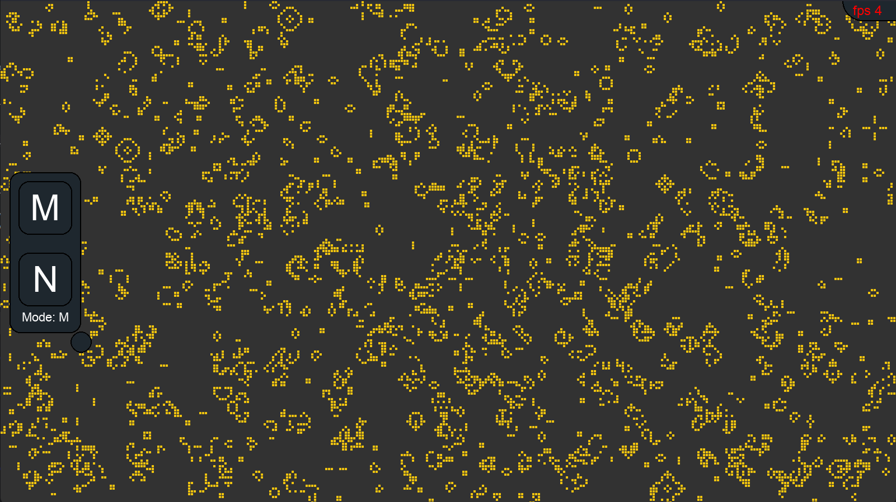

<p align="center">
  
  
</p>

<p align="center">
   
   
   
   
</p>

## About Life

The game of Life is a cellular automaton written using Python.

## Installation

Clone the repository and run the file **_main.py_**.
Make sure that all [requirements](#requirements) are met.

## Requirements

_The Python interpreter version 3.10+_

All python dependencies specified in the file [requirements.txt](./requirements.txt)

    pip install -r requirements.txt

## Getting Started

Run [`run.py`](./run.py) using the python interpreter

### Windows

    python run.py

### Linux

    python3 run.py


## Documentation

| Key      | Action        |
|----------|---------------|
| \<SPACE> | pause of game |

Pressing the space bar will ensure that the game stops until the next key is pressed.


Also in the game it is possible to change the neighborhood calculation mode for a cell (number of counted neighbors) to **"Moore neighborhood"** and **"Neumann neighborhood"**.\
This can be done using two buttons on the screen, which can be minimized at will.

---

### Flags

#### --debug

If your game crashes and you want to understand why this is happening, or maybe you just want to see the entire
event log, then specify the `--debug` or `-D` flag. This will allow the game to enable internal logging, which will
be saved to the `debug.log` file in the `src/log` directory (generated automatically).

```bash
python ./main.py --debug  # Enable game logging
```

#### --hide-fps

If you want to disable the display of fps in the game in the upper right corner, then use the flag `--hide-fps` or `-H`

```bash
python ./main.py --hide-fps  # Disable showing fps in game
```

#### --Moore

If you want to explicitly (because this parameter is set by default) enable the so-called Moore neighborhood that counts all 8 cell neighbors, use `--Moore` or `-M` flags.

```bash
python ./main.py --Moore
```

#### --Neumann

If you want to include the so-called Neumann neighborhood that allows the game to count only 4 neighbors for a cell, use `--Neumann` or `-N` flags.

```bash
python ./main.py --Neumann
```

## Developers

- [Qu1nel](https://github.com/Qu1nel)

## License

[MIT](./LICENSE) © [Ivan Kovach](https://github.com/Qu1nel/)

This Project Qu1nel.CellularAutomaton in distributive under the **[MIT License](./LICENSE)**, and it also uses those codes that are distributed under the **[MIT License](./LICENSE)**.
